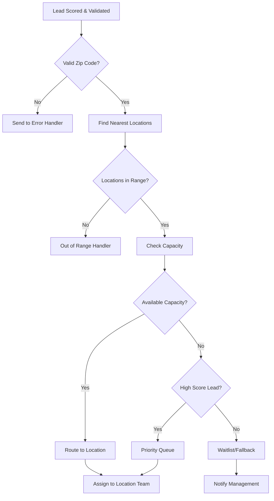

# GHL Automation Workflow: Intelligent Lead Processing

## Workflow Overview
This automation handles the complete lead journey from Facebook ad capture through location assignment and follow-up, with sophisticated edge case handling.

## Trigger: Facebook Lead Ad Webhook

### Workflow Steps

#### Step 1: Lead Capture & Validation
```
🎯 TRIGGER: Facebook Lead Ad Submitted
├── Data Received: Name, Email, Phone, Zip Code, Ad Source
├── Custom Field Mapping:
│   ├── fb_campaign_id → Lead Source Campaign
│   ├── fb_ad_id → Lead Source Ad
│   └── utm_parameters → Lead Source Details
└── Initial Lead Score: Base = 60 (Facebook source)
```

#### Step 2: Lead Enrichment & Scoring
```
📊 CUSTOM CODE ACTION: Enhanced Lead Scoring
├── Inputs: Lead data, timestamp, campaign info
├── Processing:
│   ├── Profile completeness check (+10 if phone & email)
│   ├── Time-based scoring (+5 during business hours)
│   ├── Campaign quality multiplier (1.0-1.3x)
│   └── Geographic validation
└── Outputs: Enhanced lead score, validation status
```

#### Step 3: Geographic Processing
```
🗺️ CUSTOM CODE ACTION: Zip Code Processing
├── Inputs: Lead zip code, all location data
├── Processing:
│   ├── Validate zip code format
│   ├── Calculate distances to all locations
│   ├── Filter locations within service radius (25 miles)
│   └── Sort by proximity
└── Outputs: Nearest locations array, distance data
```

#### Step 4: Capacity Check & Location Selection
```
⚡ WEBHOOK TO EXTERNAL API: Real-time Capacity Check
├── Endpoint: /api/locations/capacity-check
├── Payload: {nearestLocations, leadScore, timestamp}
├── Processing:
│   ├── Query current lead counts per location
│   ├── Check business hours and operational status
│   ├── Apply routing business rules
│   └── Select optimal location
└── Response: {selectedLocation, reason, fallbackOptions}
```

#### Step 5: Decision Logic Flow



#### Step 6: Location Assignment & Notification

##### For Successful Routing:
```
✅ IF: Location Selected Successfully
├── Update Contact Record:
│   ├── assigned_location_id
│   ├── routing_timestamp
│   ├── routing_reason
│   └── expected_response_time
├── Add to Location Sub-Account:
│   ├── Transfer contact to location pipeline
│   ├── Set location-specific tags
│   └── Trigger location automation
└── Send Notifications:
    ├── SMS to Location Manager: "New lead assigned"
    ├── Email to Sales Team: Lead details + context
    └── Slack notification with lead summary
```

##### Location-Specific Follow-up Sequence:
```
📞 LOCATION AUTOMATION TRIGGER: New Lead Assigned
├── Immediate (0 minutes):
│   ├── Send welcome SMS to lead
│   └── Email with location details & next steps
├── 15 Minutes:
│   ├── Phone call attempt #1
│   └── Update lead status to "contacted"
├── 2 Hours (if no answer):
│   ├── Follow-up SMS with booking link
│   └── Email with success stories
├── 24 Hours (if no response):
│   ├── Phone call attempt #2
│   └── Personalized video message
└── 3 Days (final attempt):
    ├── Special offer email
    └── Mark as "nurture sequence"
```

#### Step 7: Edge Case Handlers

##### Invalid Zip Code Handler:
```
❌ EDGE CASE: Invalid/Missing Zip Code
├── Action: Custom Code Function
├── Process:
│   ├── Log error with lead details
│   ├── Send lead to manual review queue
│   ├── Tag contact as "requires_manual_routing"
│   └── Notify operations team
├── Follow-up:
│   ├── Email to lead requesting zip code
│   └── SMS with location finder link
└── Escalation: Manual assignment within 1 hour
```

##### Out of Service Area Handler:
```
🚫 EDGE CASE: No Locations in Range
├── Action: Data Collection & Future Planning
├── Process:
│   ├── Store lead in "expansion_prospects" list
│   ├── Tag with requested service area
│   ├── Send to headquarters dashboard
│   └── Auto-response explaining situation
├── Immediate Response:
│   ├── Professional email explaining coverage
│   ├── Offer virtual consultation option
│   └── Request to be notified of future expansion
└── Long-term: Trigger expansion analysis report
```

##### No Capacity Handler:
```
⚠️ EDGE CASE: No Available Capacity
├── High-Value Lead (Score ≥ 80):
│   ├── Add to priority queue at closest location
│   ├── Notify location manager immediately
│   ├── Set follow-up task for next day
│   └── Send premium holding message
├── Standard Lead (Score < 80):
│   ├── Add to general waitlist
│   ├── Send to lower-priority location if available
│   ├── Trigger nurture sequence
│   └── Weekly status update
└── System Actions:
    ├── Alert franchise owner if system-wide capacity issue
    ├── Auto-adjust daily lead limits if needed
    └── Generate capacity planning report
```

##### System Failure Handler:
```
💥 EDGE CASE: System/API Failure
├── Immediate Failover:
│   ├── Route to default location (headquarters)
│   ├── Tag as "requires_manual_routing"
│   └── Send alert to technical team
├── Lead Processing:
│   ├── Continue with basic automation
│   ├── Queue for re-processing when system recovers
│   └── Ensure no lead is lost
└── Recovery Actions:
    ├── Re-run routing for failed leads
    ├── Validate data integrity
    └── Send recovery status report
```

#### Step 8: Analytics & Reporting
```
📈 CONTINUOUS: Data Collection & Analysis
├── Real-time Metrics:
│   ├── Routing success rate
│   ├── Average routing time
│   ├── Capacity utilization per location
│   └── Edge case frequency
├── Daily Reports:
│   ├── Lead distribution by location
│   ├── Conversion rates by source
│   ├── Response time analysis
│   └── Capacity planning insights
└── Webhook to Analytics System:
    ├── All routing decisions logged
    ├── Performance metrics tracked
    └── Business intelligence dashboard updated
```

## Workflow Configuration in GHL

### Automation Settings:
- **Trigger**: Webhook (Facebook Lead Ads)
- **Execution**: Immediate
- **Error Handling**: Retry 3x with 5-minute delays
- **Timeout**: 30 seconds per step
- **Logging**: Full activity log enabled

### Custom Fields Created:
- `assigned_location_id` (Text)
- `routing_timestamp` (Date/Time)
- `routing_reason` (Text)
- `lead_final_score` (Number)
- `expected_response_time` (Text)
- `capacity_status` (Text)
- `distance_to_location` (Number)

### Tags Used:
- `fb_lead_processed`
- `high_priority_lead`
- `manual_routing_required`
- `out_of_range`
- `waitlist_member`
- `routing_failed`

## Monitoring & Optimization

### Key Performance Indicators:
1. **Routing Success Rate**: Target >95%
2. **Average Routing Time**: Target <30 seconds
3. **Edge Case Rate**: Target <5%
4. **Location Balance**: No location >150% of average

### Automated Optimization:
- Daily analysis of routing patterns
- Automatic adjustment of scoring algorithms
- Capacity threshold optimization
- Geographic boundary refinement

This workflow ensures every lead is processed intelligently with comprehensive edge case handling and maintains high performance even at scale.
