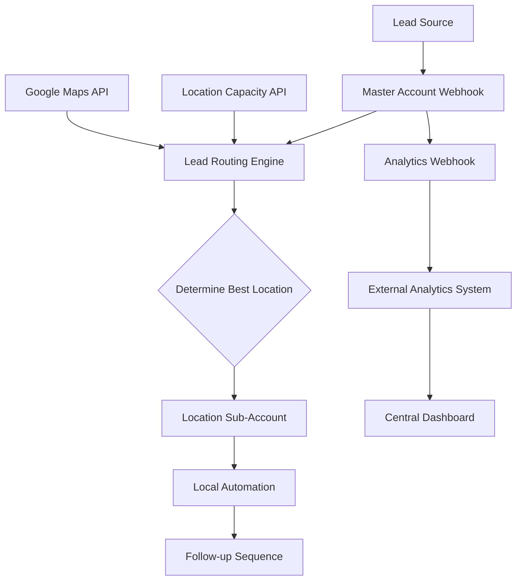

# GHL Developer Challenge - Multi-Location Fitness Franchise Solution

## Part 1: Technical Architecture Overview

### A. System Architecture in GHL

#### Sub-Account Structure
```
🏢 HQ Master Account (Franchise Owner)
├── 📊 Central Dashboard & Reporting
├── 🔧 Master Automation Templates
├── 📋 Lead Routing Configuration
└── 🏃‍♂️ Location Sub-Accounts (25 → 100+)
    ├── Location 1 (Downtown Fitness Hub)
    ├── Location 2 (Westside Wellness Center)
    ├── Location 3 (East Valley Gym)
    └── ... (scaling to 100+)
```

#### Snapshot Strategy
- **Master Snapshot**: Core automations, lead routing logic, and reporting dashboards
- **Location-Specific Snapshots**: Customized for local needs while maintaining consistency
- **Rapid Deployment**: Automated snapshot deployment for new locations

#### Custom Development Components

1. **Lead Routing Engine** (Custom Code Action)
   - Intelligent routing based on proximity, capacity, and lead quality
   - Real-time capacity management
   - Fallback logic for edge cases

2. **Central Dashboard Widget** (HTML/CSS/JS)
   - Real-time conversion metrics across all locations
   - Capacity monitoring and alerts
   - Performance comparisons and trends

3. **Webhook Analytics System** (External Integration)
   - Processes GHL webhooks for advanced analytics
   - Data warehouse integration
   - Custom reporting and insights

4. **Bulk Location Onboarding Tool** (External Script)
   - Automated sub-account creation
   - Snapshot deployment
   - Configuration management

### B. Data Flow Architecture



#### Data Synchronization
- **Real-time**: Lead routing decisions, capacity updates
- **Batch Processing**: Daily reports, performance analytics
- **Webhook Events**: Lead assignments, conversion tracking

### C. Scalability Design

#### Performance Optimizations
- **Caching Layer**: Location data, zip code mappings
- **Load Balancing**: Webhook processing across multiple endpoints
- **Database Optimization**: Indexed queries for fast location lookup

#### Monitoring & Alerting
- **Health Checks**: Automated system monitoring
- **Capacity Alerts**: Real-time notifications when locations reach capacity
- **Performance Metrics**: Response time, routing accuracy, conversion rates

## Technical Implementation Highlights

### 1. Intelligent Lead Scoring
- Multi-factor scoring algorithm
- Source-based multipliers
- Time-sensitive adjustments
- Profile completeness bonuses

### 2. Advanced Routing Logic
- Geographic proximity calculation
- Real-time capacity checking
- Business rules enforcement
- Sophisticated fallback mechanisms

### 3. Edge Case Handling
- Invalid zip codes
- Out-of-service areas
- No capacity scenarios
- System failure recovery

### 4. Analytics & Reporting
- Comprehensive logging
- Performance tracking
- Conversion analytics
- Operational insights

## Maintenance & Documentation

### Code Quality Standards
- Comprehensive error handling
- Detailed logging and monitoring
- Clear documentation and comments
- Modular, testable design

### Developer Handoff
- Well-documented APIs
- Configuration management
- Testing procedures
- Deployment guidelines

This architecture provides a robust, scalable foundation that can grow from 25 to 100+ locations while maintaining performance and reliability.
